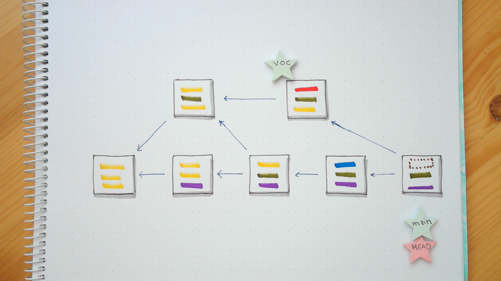

# Alice: merging with conflict resolution

In this chapter, Alice will show us how to properly manage more sophisticated
merge operations.

## Lab

* Alice will keep working hard in increasing the tension of the story in
the *main* branch, expanding one of the sentences to provide a more
immersive description:

```bash
git status  
```
```bash
sed -i 's/afloat/afloat, fighting the waves/' chapter-01.md
```
```bash
git diff chapter-01.md
```
```bash
git add chapter-01.md
```
```bash
git commit -m "Enhanced paragraph"
```

* At the same time, she also keeps pushing for a richer use of language, 
so she moves HEAD to the *vocabulary branch*

```bash
git checkout vocabulary-chapter-01
```

* Let's confirm that there is room for improvement

```bash
cat chapter-01.md  | grep -e strug -e shore -C 9999
```

* Definitively, she can make some changes

```bash
sed -i  's/struggling/floundering/' chapter-01.md
sed -z -i 's/shore/waterfront/2' chapter-01.md
```

* Just to ensure that everything is in place, Alice compares the *working area* content
with the one pointed by HEAD

```bash
git diff chapter-01.md
```

* Looks look, so she decides to move the file to the *staging* area

```bash
git add chapter-01.md
```

* And she commits the change

```bash
git commit -m "Replaced struggling and shore."
```

* Avoiding merges for a long time is considered a bad practice, so Alice will integrate
both branches. She starts checking that the current branch is not *main*:

```bash
git status
git branch
```

* Ok, so she moves to the main branch

```bash
git checkout main
```

* She has a feeling that the merge operation is going to be more complicated this time,
and she checks it by comparing the current working area (on *main*) with the files on
the *vocabulary-chapter-01* branch:

```bash
git diff vocabulary-chapter-01
```

* In any case, she needs to merge the vocabulary branch into the main one

```bash
git merge vocabulary-chapter-01 -m "Merged vocabulary" # Conflict!!
```

* Something went wrong: she has modified the same lines on both branches and
`git` doesn't know how to solve the conflict, as `status` confirms:

```bash
git status
```

* The content of the file in the working area has been altered to show both
versions of the *reality*

```bash
cat chapter-01.md
```

* Although it is easy to understand what is happening thanks to `delta`

```bash
git diff
```

* Alice decides that she will manually correct the situation to keep both
the *lighthouse keeper* and the *floundering* portions in the definitive version

```bash
L0=$(grep -n "<<<<<<<" chapter-01.md | cut -f1 -d:)
LF=$(grep -n ">>>>>>>" chapter-01.md | cut -f1 -d:)

echo Replacing from $L0 to $LF.

ed chapter-01.md << EOF
${L0},${LF}d
7i
As the waves tossed him around, Tim struggled to stay afloat, fighting the waves. Just when he thought he couldn't hold on any longer, a strong hand grabbed his wrist and pulled him to safety. It was the lighthouse keeper who had noticed him floundering from the shore.
.
w
q
EOF
```

* Yes, she has it:

```bash
cat chapter-01.md | grep -e "lighthouse keeper" -e "floundering" -C 9999
```

* Time to commit the chapter:

```bash
git status
git add chapter-01.md
git commit -m "Solved conflict, merged keeper and floundering."
```

* The resulting history is pretty cool. Both the content of the chapter and the log ;)

```bash
git log --graph --decorate --oneline
```

## Diagrams

