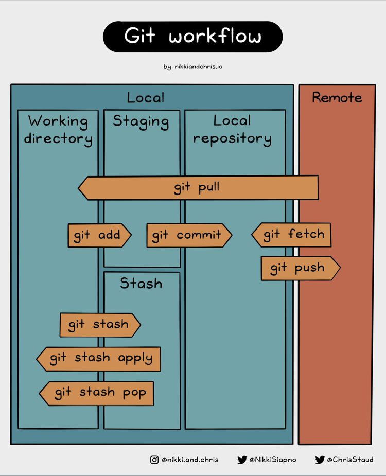

# Bob: pulling

## Lab

* Bob doesn't want to write anything today, but he is interested in reading what 
Alice has added to the story. First, he will check his own repository and ensure
he is using the main branch

```bash
cd
cd bob/book
git status
git checkout main
```

* Alice has told him to update the remote reference to point to the new bare repo,
so Bob starts by checking the old value

```
git remote
git remote get-url origin
```

<details>
<summary>
Yes, definitively he has to change the value of the origin repo, but he doesn't
want to loose the current one, so he renames it

```bash
git remote ██████ origin alice
git remote
```
</summary>

---
#### Solution

```bash
git remote rename origin alice
git remote
```
---
</details>

* Now Bob can safely create the new remote reference

```bash
git remote add origin ../../central.git
git remote
```

* Not being completely sure of how to proceed, Bob wants to check the content of 
the central repo before merging it with its own work

```bash
git fetch origin main
```

* The short-lived ref `FETCH_HEAD` can be used to refer to the data retrieved
from the remote origin

```bash
git diff FETCH_HEAD
```

<details>
<summary>
Ok, looks like Alice didn't modified anything already existing and just added the new
chapter, so Bob merges it with `main`. If he had new it, he would had used
the `pull` command instead to combine both operations into one

```bash
git merge F████_████ -m "Merged new content written by Alice"
```
</summary>

---
#### Solution

```bash
git merge FETCH_HEAD -m "Merged new content written by Alice"
```
--
</details>


* Another fantastic job, Bob thinks. And he leaves the workspace

```bash
cd ../..
```

## Moving files between areas

This diagram was created by [@nikki.and.chris](https://twitter.com/NikkiSiopno).

